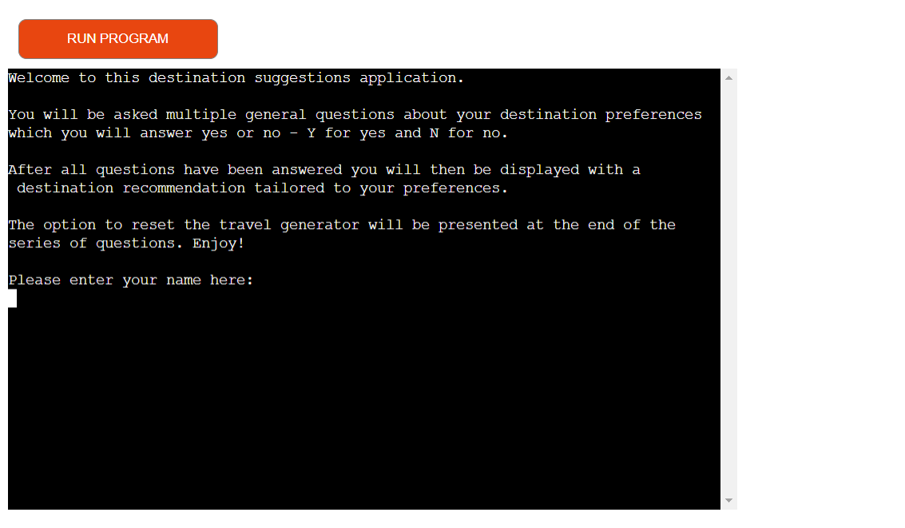
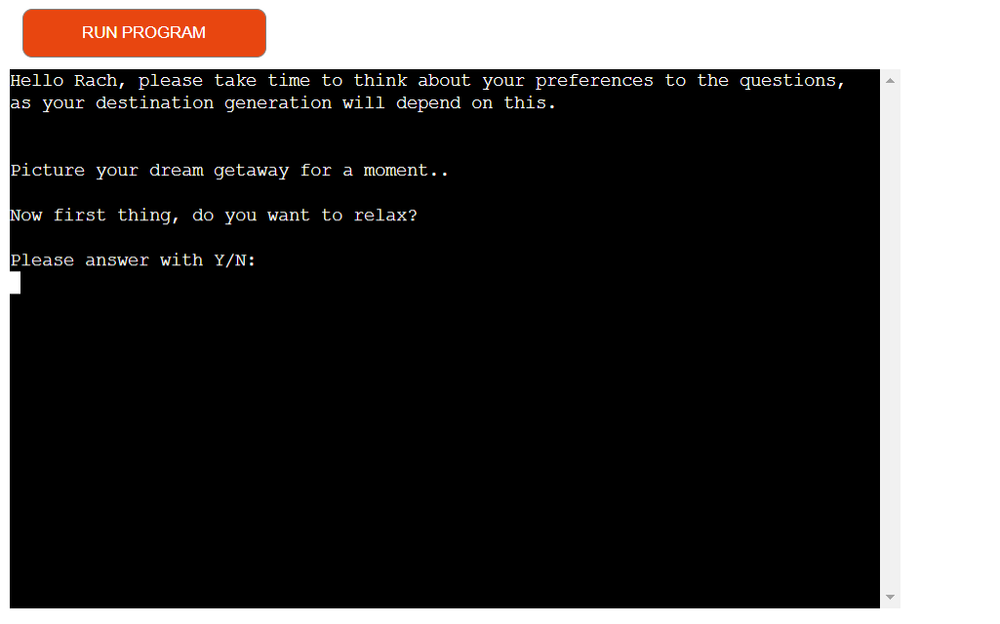
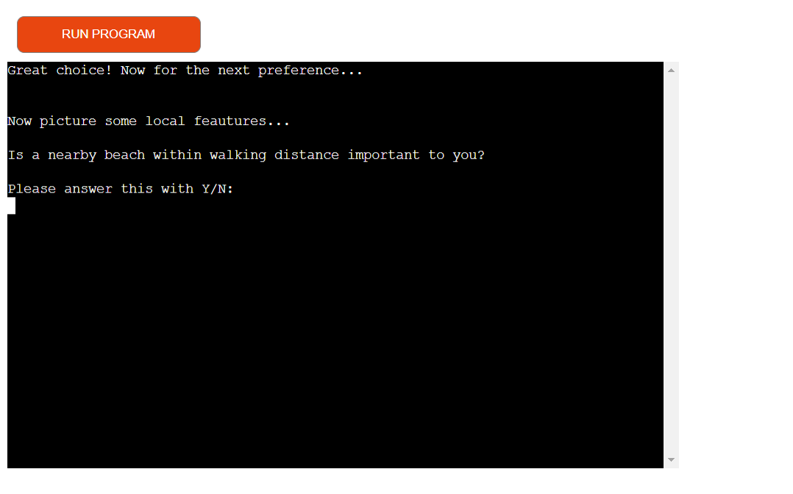
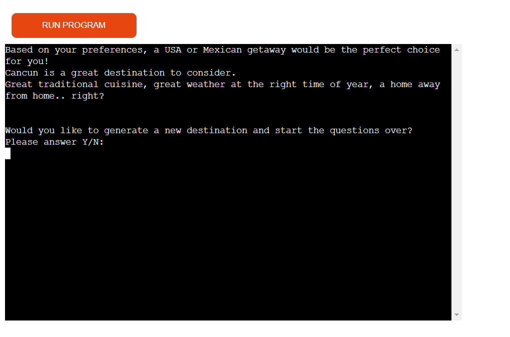
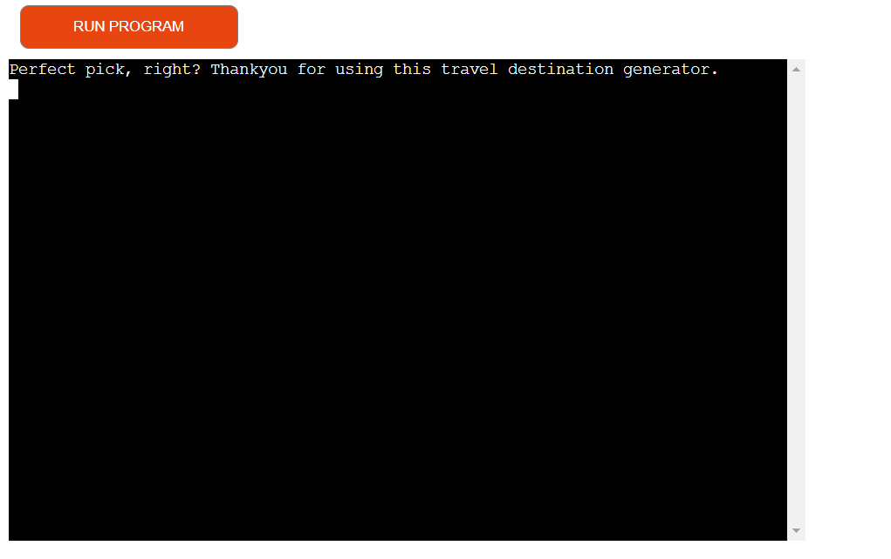
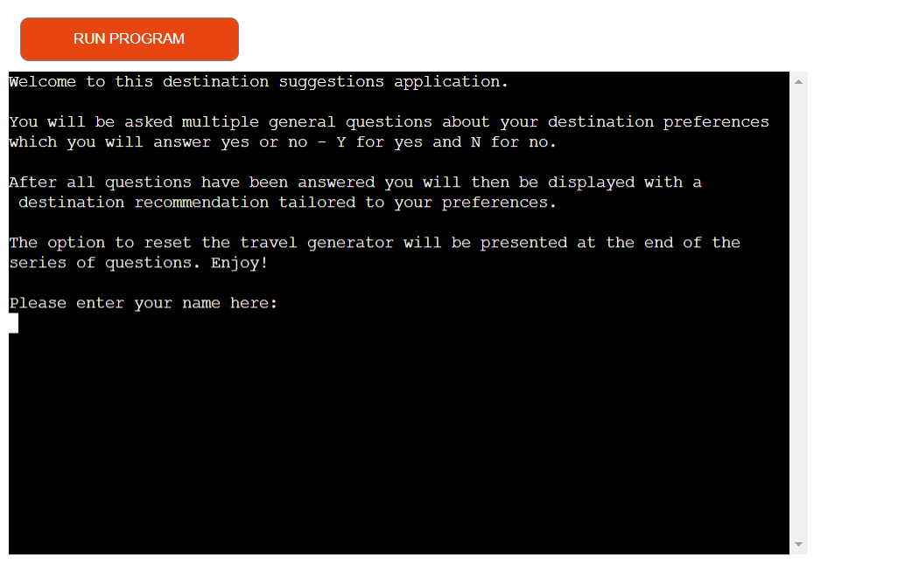
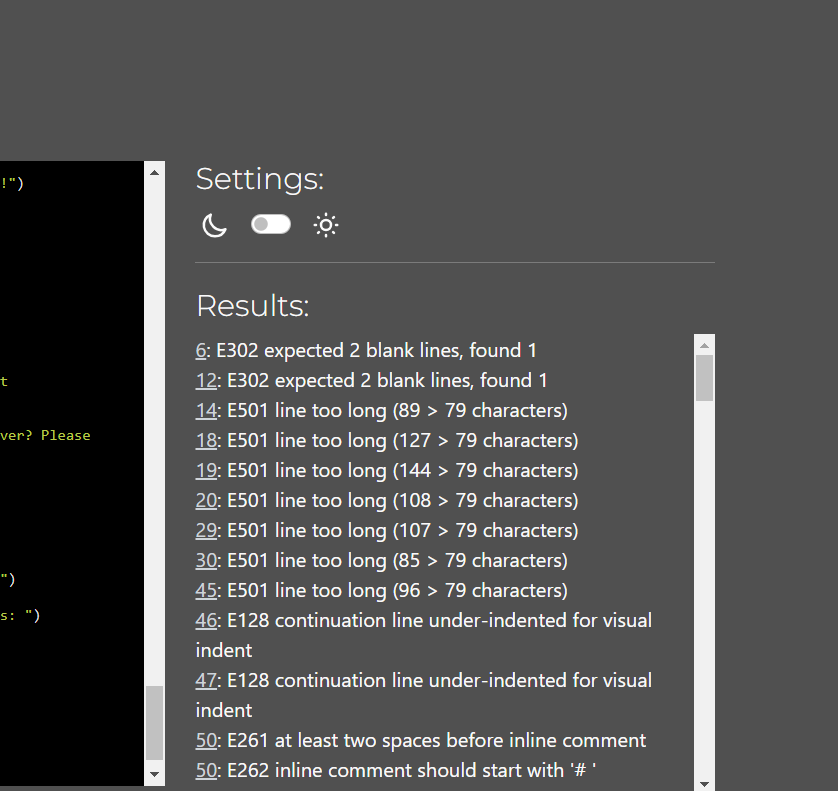
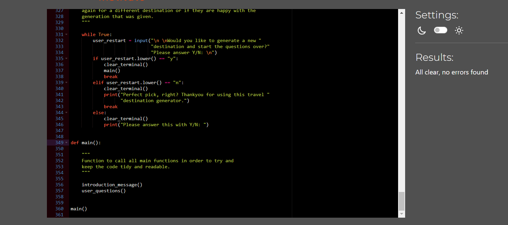
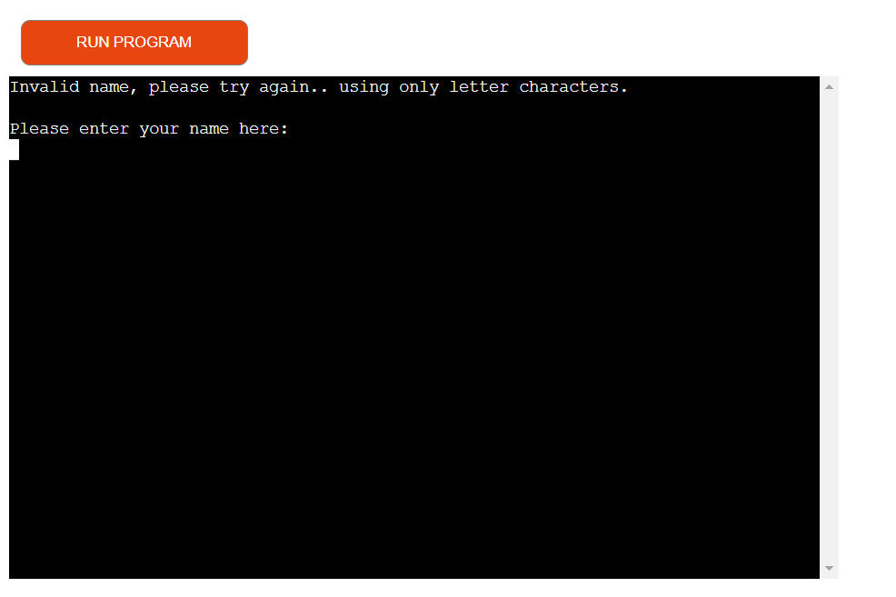
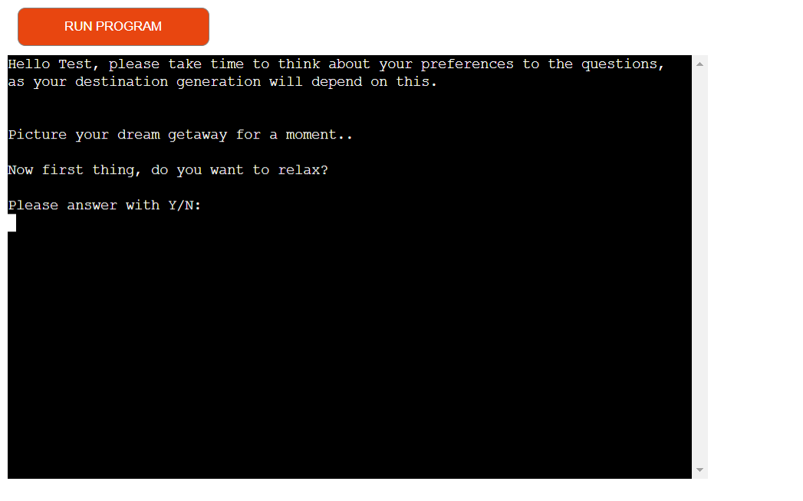

\# Travel Destination Generator

[Please visit the app here.](*link to be inserted*)

INSERT AN IMAGE HERE SHOWING THE GAME

This app was created to provide assistance to people looking for a new holiday destination or region. This app presents a series of questions to the user to that are 
quite general. The answers to these questions then tally up behind the scenes to general a conclusion once the series of questions come to an end, where the user will then be presented with a generated conclusion that would best fit their preferences.
My current full time job is a Flight Attendent for a long haul airline. The destinations that I have designed the questions around are the places that I travel to very frequently and know quite well. Personally, they are also my favourite destinations that I travel to and would love to share and recommend the experiences that I have here with other. However, although a little similar they do differ from eachother and dependant on whatever the user intends to do on their desired getaway.

## Introduction ##

In this project you will find the following:

1. An introduction message containing guidence to the application with a name input
2. A series of preference question with a yes or no answer option
3. A destination conclusion containing suggestions
4. An option to restart the questions if desired

**App owner goals**

* Create an engaging application that users would be inclined to come back to
* Allow the user to make their own choices
* Store and record user data and answer selections
* Make the app easy to use for users
* Create a clear understanding on the input required to users

**User Goals**

* As a first time user - I want to be able to start the application over if I wanted to
* As a first time user - I want to be given questions related to the application
* As a first time user - I want my destination generation to refect upon the preferences I have selected
* As a first time user - I want clear guidence on the type of input I am allowed to enter
* As a first time user - I want the application to be fast, easy and efficient to use

## UX/UI

### **Strategy** ###

One of the very first things I considered during the planning of this project website was who the audience would be and what they would expect/want.

**What I expect the user would be looking for:**

* Clear, concise instructions on how to use the application
* Displayed with general, interesting and relevent content
* The ability to submit input to the application
* A relevent outcome to the input given
* The option to easily try out and reset the application again

**Target Users:**

* 18 years plus
* People looking for a new destination to travel to
* People who look for multiple features when looking for a new destination to holiday
* People interested in travel
* People interested in learning a little more about other destinations

### **Scope** ###

The features added to ensure that the user gets the best and the most out of their experience are:

* An introduction message when first running the programme, containing clear and concise instructions - this contains information about what the application is for and what the purpose of the application is for.
* A user input feild where the user can enter their name - the terminal will then present a greeting message using the users inputted name to confirm that  the application has recieved the input from the user.
* A series of questions relating to destinations which the user can answer either yes or no to.
* A short conclusion is generated at the end of the questioning section where a broad destination is shown (depending on how the user answers detirmines the tally of destinations that are recorded and shown at the end). A random smaller destination within the generated country is pulled from a small list and a small overview is presented to the user.
* An option to start over and try again is located underneither the conclusion, if the user selects yes then the application will start over - if the user selects no then the user will be presented with a little thankyou message for using this application.

### **Surface** ###

As this application was made to be a text based project using the terminal, no decorative work needed to be done here. However, time has been taken to make sure that the text presents nicely into the terminal and new lines have been added where necessary and where pleasing to the eye.

## Features in more detail ##

**Instructions Section**

Upon launching the application the above content is displayed to the user. This contains basic and easy instructions on how to use the application and what the expected outputs and inputs will be. The instructions clearly state to the user the need to use only Y for yes and N for no when it comes to answering the questions. After the short instructions and introduction message the user is asked to input their name in the feild below.

**Questions**

Once the user has entered their name, inputting only letter characters, they are they given a little message using their name input that is displayed at the top of the terminal - this acts as a way to tell the user that the application is working and is recieving and recording their inputs properly. 

The start of the questions is then presented underneith in quite an informal but still friendly mannor - the works as a way to create ease and comfort to the user. There is then a short line of instructions reminding the user that they must only answer in the following ways.

**User answering yes:**

A short message is displayed to the user depending on which question was answered yes to. This acts as a way to reassure the user still that their input is being recieved and recorded correctly.

**User answering no:**

A short message is displayed to the user depending on which question was answered no to. This acts as a way to reassure the user still that their input is being recorded and recieved correctly.

**Conclusion**

Once the series of questions have been answered appropriatly by the user, a short conclusion will be displayed to the user which would have been generated depending on if the answers related to the destination or not. This conclusion will include a small message recommeding one or more destinations. An option is then presented at the bottom of this conclusion asking the user if they would like to reset the travel generator application and start again.

**No to restarting the application**

If the user was t0 answer no to the application reset question then this is the short and final message the user will be presented with. If the user then wanted to decide that they actually did want to reset the game then this can be achieved through pressing the run programme button with will restart the application up again.

**Yes to restarting the application**

If the user was to answer yes to the application reset question then the application will be reset completely and the user will be brought right back to the start again. This does ask the user to input their name again, this is incase there is more people present who would like to generate their own destination and want a more personalised approach.

## Dependencies

**Import OS**

The import os module was used quite consistantly throughout my python based project. This allowed me to interact with the operating system which I needed to do when it came to clearing the terminal for a tidier looking terminal - opting for a better user experience overall.

**Import Random**

Import random was using during my project but not in huge amounts. I used this to be able to pull out a random smaller destination out of my lists to display to the user.

## Technologies Used 

* [Python](https://www.python.org/)
  This technology was used to create the entire project.
* [GitHub](https://github.com/)
  This technology was used to securely store all of my code in a resporitory.
* [Heroku](https://www.heroku.com/home?)
  This technology was used to easily and efficently deploy my application project.
* [Git](https://git-scm.com/)
  This technology was used to make changes to my code aswell as manage version control.
* [Codeanywhere](https://app.codeanywhere.com/)
  This technology was used as my coding development environment.
* [Code Institute Python Linter](https://pep8ci.herokuapp.com/)
  This technology was used to validate my python code.
* [Slack](https://slack.com/intl/en-ie/)
  This technology was used a lot in order to easily find solutions from other students and the educational content provided within the channels.

  ## Testing

**Code Institute Python Code Validator**

When I first passed my code through the validator it was displaying multiple errors and warnings which I worked through and then got into the habbit of writing the rest of the code on how it would be passed through the validator.

After working through the code and learning how to write the rest of the code in the type of format that the validator would accept I resolved all errors and warnings.

**User name input**

When I created the feature in my project to allow the user to enter their name into the terminal I wanted the application to only allow letter characters and not numbers. The length of the name isn't something that I saw to be a problem which I did add at first and then later look out incase some users wished to have a longer name than the average. For this input my code only allows users to procceed with letters and not numbers or special characters which I will show below: 

Once the user name input is accepted by the application the following message is shown as clear indication:

